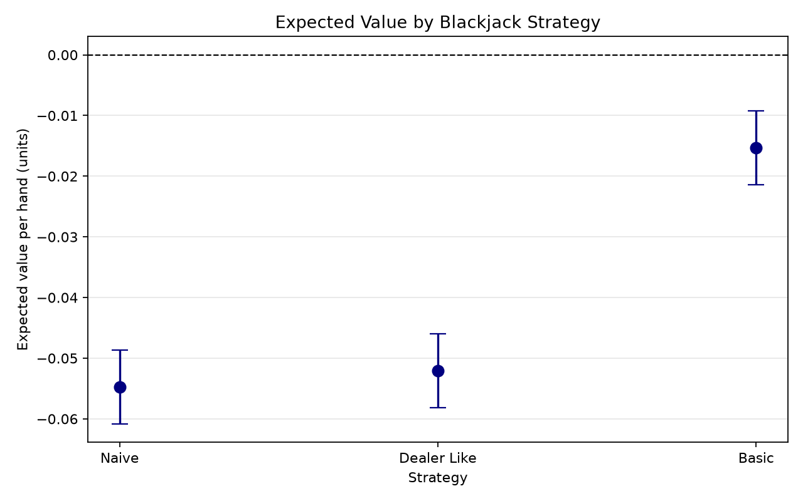
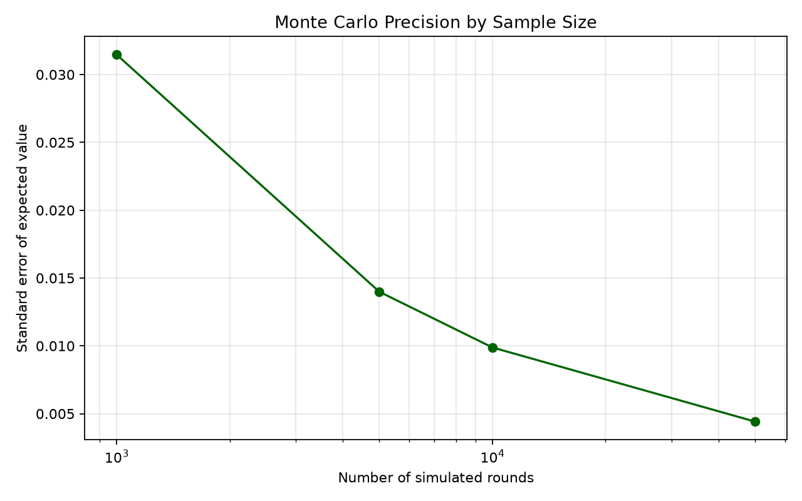

# Monte Carlo Simulation of Blackjack

This project uses Monte Carlo simulation to compare Blackjack strategies and estimate their expected value and house advantage.

The main version models single-deck Blackjack using hit and stand decisions.
Developed for ACM40960.

The accompanying background research is available in [blackjack_literature_review_25203038.pdf](blackjack_literature_review_25203038.pdf).

## Project aim

The project considers the following question:

> How can Monte Carlo simulation be used to estimate the expected value and house advantage of single-deck Blackjack under different player strategies?

Three player strategies are compared:

* **Naive:** hit below 17 and otherwise stand.
* **Dealer-like:** hit below 17 and also hit a soft 17.
* **Basic:** use the player total and dealer upcard to decide whether to hit or stand.

## Game rules

The baseline simulation uses:

* one standard 52-card deck;
* cards drawn without replacement during each round;
* a newly shuffled deck before each round;
* dealer stands on soft 17;
* natural Blackjack pays 3:2;
* no doubling;
* no splitting;
* no surrender;
* hit and stand decisions only.

Starting with hit and stand keeps the model understandable and makes it easier to test the probability calculations.

## Project structure

```text
blackjack_sim/
    analysis.py       Statistical summaries and confidence intervals
    card.py           Playing-card model
    cli.py            Command-line interface
    dealer.py         Dealer behaviour
    deck.py           Finite shuffled deck
    experiments.py    Strategy comparisons and plots
    game.py           Single-round game engine
    hand.py           Blackjack hand scoring
    outcome.py        Round outcomes and payoffs
    player.py         Player turn
    rules.py          Game rules
    simulation.py     Monte Carlo simulation runner
    strategies.py     Player strategies
    validation.py     Probability and convergence checks

tests/                Automated tests
outputs/              Generated tables and plots
data/                 Reserved for generated datasets

main.py               Run one simulation
run_experiments.py    Compare all strategies
run_validation.py     Run validation experiments
requirements.txt      Python dependencies
```

## Installation

Python 3.10 or newer is required.

Create a virtual environment:

```bash
python3 -m venv .venv
```

Activate it on macOS or Linux:

```bash
source .venv/bin/activate
```

Activate it on Windows PowerShell:

```powershell
.venv\Scripts\Activate.ps1
```

Install the required packages:

```bash
python -m pip install -r requirements.txt
```

## Running one simulation

The following command runs 100,000 rounds using basic strategy:

```bash
python main.py \
  --strategy basic \
  --rounds 100000 \
  --seed 25203038
```

Available strategy names are:

```text
naive
dealer-like
basic
```

To make the dealer hit soft 17, add:

```bash
--hit-soft-17
```

The natural Blackjack payout can also be changed:

```bash
--blackjack-payout 1.2
```

The package can also be run directly:

```bash
python -m blackjack_sim \
  --strategy basic \
  --rounds 100000
```

## Comparing strategies

Run the strategy comparison with:

```bash
python run_experiments.py \
  --rounds 100000 \
  --seed 25203038 \
  --output-dir outputs
```

This creates:

```text
outputs/strategy_comparison.csv
outputs/strategy_expected_value.png
```

## Statistical measures

The payoff from each round is recorded in units:

* normal win: `+1`;
* natural Blackjack: `+1.5`;
* push: `0`;
* loss: `-1`.

If the payoff from round `i` is `Y_i`, expected value is estimated by:

```text
EV = (1 / n) × sum(Y_i)
```

House edge is calculated from the player’s expected value:

```text
House edge = -EV
```

The estimated standard error is:

```text
SE = sample standard deviation / sqrt(n)
```

The reported 95% confidence interval is:

```text
EV ± 1.96 × SE
```

## Strategy comparison results

Each strategy was simulated for 100,000 rounds using the random seed `25203038`.

| Strategy    | Win rate | Loss rate | Push rate | Expected value | House edge | Player bust rate |
| ----------- | -------: | --------: | --------: | -------------: | ---------: | ---------------: |
| Naive       |  41.366% |   49.221% |    9.413% |       -0.05476 |     5.476% |          27.040% |
| Dealer-like |  41.553% |   49.139% |    9.308% |       -0.05207 |     5.207% |          27.424% |
| Basic       |  43.840% |   47.752% |    8.408% |       -0.01533 |     1.533% |          16.913% |

The 95% confidence intervals for expected value were:

| Strategy    | Lower limit | Upper limit |
| ----------- | ----------: | ----------: |
| Naive       |    -0.06084 |    -0.04867 |
| Dealer-like |    -0.05815 |    -0.04598 |
| Basic       |    -0.02145 |    -0.00920 |

Basic strategy gave the strongest result. Its estimated loss was approximately 1.53 units per 100 hands, compared with about 5.48 units for the naive strategy.

The improvement from naive to basic strategy was approximately `0.03943` units per hand. The confidence intervals for these strategies did not overlap in this experiment.

The dealer-like and naive strategies produced similar results. Their confidence intervals overlapped, so the small difference between them should not be treated as strong evidence that one is better.

Because this model does not include doubling or splitting, the basic-strategy result should not be compared directly with the house edge from a complete casino Blackjack game.



## Model validation

### Natural Blackjack frequency

For a single deck, a natural Blackjack requires one ace and one ten-value card in either order.

```text
P(natural Blackjack) = 128 / 2652
                     ≈ 0.048265
```

The validation used 100,000 simulated rounds.

| Measure                        |                    Value |
| ------------------------------ | -----------------------: |
| Theoretical frequency          |                  4.8265% |
| Observed frequency             |                  4.9220% |
| Absolute difference            | 0.0955 percentage points |
| Three-standard-error tolerance | 0.2033 percentage points |
| Result                         |                     Pass |

The observed natural frequency was inside the validation tolerance.

### Monte Carlo convergence

The standard error and confidence-interval width decreased as the number of simulated rounds increased.

| Rounds | Expected value | Standard error | 95% interval width |
| -----: | -------------: | -------------: | -----------------: |
|  1,000 |        0.00750 |        0.03146 |            0.12332 |
|  5,000 |       -0.02450 |        0.01399 |            0.05483 |
| 10,000 |       -0.02715 |        0.00988 |            0.03874 |
| 50,000 |       -0.02062 |        0.00442 |            0.01732 |

At 1,000 rounds, the confidence interval was wide enough to include both positive and negative values. By 50,000 rounds, it was much narrower and entirely negative.

This agrees with the expected relationship that Monte Carlo standard error decreases approximately in proportion to `1 / sqrt(n)`.



Run the validation again with:

```bash
python run_validation.py \
  --natural-rounds 100000 \
  --sample-sizes 1000 5000 10000 50000 \
  --seed 25203038 \
  --output-dir outputs
```

The validation command creates:

```text
outputs/natural_blackjack_validation.csv
outputs/convergence.csv
outputs/convergence_standard_error.png
```

## Running the tests

Run the complete test suite with:

```bash
python -m pytest -q
```

The project contains 98 automated tests covering:

* playing-card values;
* finite deck size and draws without replacement;
* seeded shuffling;
* ace handling and hand totals;
* natural Blackjack and bust detection;
* dealer behaviour;
* player strategies;
* round settlement;
* reproducible simulation;
* expected value and confidence intervals;
* CSV and plot generation;
* theoretical probability validation.

## Reproducibility

The reported experiments use the random seed `25203038`.

Using the same source code, dependency versions, number of rounds and seed should reproduce the same results.

The dependency versions used for the final experiment are recorded in `requirements.txt`.

## Limitations

The current simulation intentionally uses a limited action set. It does not include:

* doubling down;
* splitting pairs;
* surrender;
* insurance;
* continuous shoe penetration;
* card counting.

A new deck is shuffled before every round. This gives independent rounds and preserves finite-deck probabilities within each hand, but it does not model several consecutive hands being dealt from the same shoe.

The basic strategy is total-dependent rather than composition-dependent. It uses the player total, whether the hand is soft, and the dealer upcard.

## Possible extensions

Future work could add:

* double and split decisions;
* multiple deck sizes;
* different Blackjack payouts;
* continuous shoe simulation;
* Hi-Lo card counting;
* composition-dependent strategy;
* reinforcement-learning strategies.

These are left as extensions so that the main single-deck model remains transparent and testable.

## Disclaimer

This project is for academic and educational purposes. It does not encourage gambling.

## NEERAJ SRIVASTAVA - 25203038
